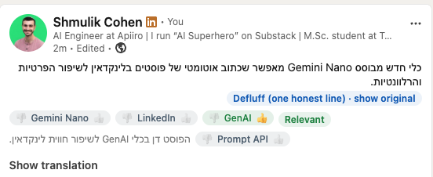
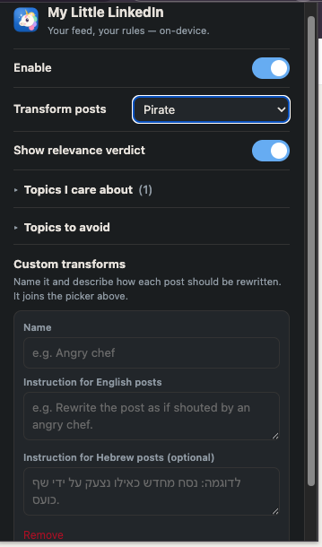

<p align="center">
  
</p>

<h1 align="center">My Little LinkedIn</h1>

<p align="center">
  <em>Your feed, your rules — rewrite every post, tag what you care about, and get a relevance verdict on each one. 100% on-device. No account, no API key, no backend.</em>
</p>

---

## The story

It started with [**Defluffer**](https://chromewebstore.google.com/detail/defluffer/ofaajilnnjfcinocgpljpmchpcnbhhln), which trims fluffy LinkedIn posts to one honest line. I read its source and found the twist: it ships post text to a Cloudflare Worker that calls Gemini server-side — clever, but it means running a backend.

So I built my own variation on the thing already sitting in Chrome: the **built-in Prompt API (Gemini Nano)**, a real LLM that runs *locally in the browser* — no server, no key, nothing leaving your machine. **My Little LinkedIn** turns that into a general feed lens: swap the transform, tag the topics you care about, and get a per-post verdict.

## See it

<p align="center">
  
</p>
<p align="center">
  
</p>

## What it does

- **Transform every post** — rewrites the body in place as you scroll (with a *show original* toggle): Defluff · Pirate · Fluff · Plain summary · Gen-Z · Shakespeare · Corporate — or your **own** custom prompt.
- **Relevance verdict** — topic tags plus a **Relevant / Neutral / Muted** chip; muted posts are gently dimmed.
- **👍 / 👎 the tags** — thumb a topic to *care* or *avoid*; it's saved and reshapes future posts (like + dislike on one post cancels to Neutral).
- **English & Hebrew** — each post is rewritten in **its own language** (a Hebrew post gets a Hebrew pirate).
- **Fast & polite** — only what's on screen is computed, and work is **cancelled the moment you scroll past**; a spinner shows what's running.

## How it works

Everything runs through Chrome's built-in `LanguageModel` (Prompt API / Gemini Nano):

- The rewritten line **copies the post's computed typography** and cross-fades in, so it reads as native LinkedIn text.
- Verdict + rewrite come from **one** structured model call, and results are **cached** by post text.
- An `IntersectionObserver` + per-post `AbortController` means off-screen posts never burn compute.

No network requests, no analytics — only your settings are stored, in Chrome's sync storage.

## How it compares

Plenty of LinkedIn cleaners and plenty of Gemini Nano assistants exist — but they sit on opposite sides of two lines, and this crosses both:

| | How it runs the AI | How it acts on your feed |
| --- | --- | --- |
| **Defluffer / LinkedIn TLDR** | Backend (server-side Gemini) | Summarize posts to one line |
| **Keyword muters** (Topic Filter, LinkedOut, LinkOff) | No AI — string matching | Hide posts containing a word |
| **Nano assistants** (NanoBot, Gemini Nano Assistant) | On-device | On-demand — you highlight text or open a chat |
| **My Little LinkedIn** | **On-device (Prompt API)** | **Ambient — rewrites every post in place + a semantic relevance verdict as you scroll** |

It's the only one that's both **on-device** (unlike Defluffer/TLDR) *and* an **ambient feed lens** (unlike assistants you invoke). And because it judges *meaning*, "Muted" catches a post about layoffs even when the word never appears.

## Install (developer mode)

> **Not on the Chrome Web Store yet.** If there's demand, I'll pay the $5 fee and publish it. For now, load it unpacked:

1. Use **Chrome 138+**.
2. At `chrome://flags`, set:
   - `#prompt-api-for-gemini-nano` → **Enabled**
   - `#optimization-guide-on-device-model` → **Enabled BypassPerfRequirement**
   - If your Chrome shows any other built-in-AI flag (e.g. an "On-Device AI" toggle), enable it too.
3. Restart Chrome.
4. Fetch the model (~2 GB, once per profile): open `chrome://components`, find **Optimization Guide On Device Model**, and click **Check for update**. It works on first use anyway, but this pulls it ahead of time.
5. Go to `chrome://extensions`, enable **Developer mode**, click **Load unpacked**, and select the **`src/`** folder.
6. Open your LinkedIn feed. If the model isn't ready you'll get an honest little "on-device AI unavailable" note instead of silent nothing.

## Privacy

There is no server. The extension only touches `linkedin.com`, stores only your settings, and collects nothing.

## Repo layout

```
src/        the extension — "Load unpacked" this folder
  manifest.json, *.js, *.css, popup.html
  icons/    the 16/48/128 icons referenced by the manifest
assets/     logo + Chrome Web Store promo art (not shipped in the extension)
```

## License

[MIT](LICENSE).

## Credits

Inspired by [Defluffer](https://chromewebstore.google.com/detail/defluffer/ofaajilnnjfcinocgpljpmchpcnbhhln) — thank you for the spark. Rebuilt from scratch on-device, and generalized into a whole feed lens.
